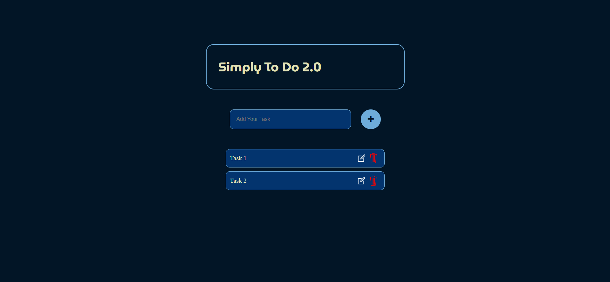

# Simply To Do V2

Simply To Do V2 is a minimalist and user-friendly to-do web application built with React, converted from the original HTML, CSS, and JavaScript project "Simply To Do." This version leverages React’s component-based architecture to improve code organization, maintainability, and performance. Try the live demo linked below!<br>



## Features

- **Task Management**: Add, edit, delete, and mark tasks as complete or incomplete.
- **Responsive Design**: Optimized for both desktop and mobile devices.
- **Real-Time Updates**: React’s state management ensures that the task list is updated immediately as you interact with it.
- **Local Storage**: Tasks are stored in the browser’s local storage, so your list remains available even after a page refresh.
  
## Live Demo

Check out the live demo [here](https://anugraheeth.github.io/Simply-To-Do-V2/) to see Simply To Do V2 in action!

## Installation

1. Clone the repository:

   ```bash
   git clone https://github.com/anugraheeth/simply-todo-v2.git
   cd simply-todo-v2
   ```

2. Install dependencies:

   ```bash
   npm install
   ```

3. Start the development server:

   ```bash
   npm start
   ```

4. Open [http://localhost:3000](http://localhost:3000) to view it in your browser.

## Usage

- **Add Task**: Enter a task in the input field and click "Add" to add it to the list.
- **Edit Task**: Click on a task to edit the text.
- **Delete Task**: Click the delete button next to each task to remove it.
- **Mark as Complete**: Check the box to mark a task as complete or incomplete.

## Tech Stack

- **React** - Core framework
- **CSS** - Styling
- **JavaScript** - Functionality
- **LocalStorage** - Persist data between sessions

## Code Explanation

This section details the core JavaScript and React logic.

### State Variables

- **tasks**: Stores the list of tasks. It is updated every time a task is added, removed, edited, or reordered.
- **newtask**: Stores the current task input text.
- **draggedIndex**: Holds the index of a task when dragging starts to enable task reordering.

### useEffect Hook

The `useEffect` hook runs when the component mounts, loading any existing tasks from `localStorage`:

```javascript
useEffect(() => {
    const stored = JSON.parse(localStorage.getItem("tasks"));
    if (stored) {
        setTasks(stored);
    }
}, []);
```

### Functions

#### inputTask

This function updates `newtask` whenever the input field value changes:

```javascript
function inputTask(e) {
    setNewTask(e.target.value);
}
```

#### add

The `add` function is triggered when a new task is added:

```javascript
function add() {
    if (newtask !== "") {
        setTasks(prevTasks => {
            const updatedTasks = [...prevTasks, newtask];
            localStorage.setItem("tasks", JSON.stringify(updatedTasks));
            return updatedTasks;
        });
        setNewTask("");
    }
}
```

- **Logic**: If `newtask` is not empty, a new task is added to `tasks`. The list is then saved to `localStorage`, ensuring persistence.

#### edit

The `edit` function allows a task to be edited by setting `newtask` to the selected task and removing the original task from `tasks`:

```javascript
function edit(index) {
    const value = tasks.filter((_, i) => i === index);
    setNewTask(value);
    removeTask(index);
}
```

- **Logic**: `edit` identifies the selected task based on the index, sets it as `newtask` for editing, and then calls `removeTask` to remove the task.

#### removeTask

The `removeTask` function removes a specific task by its index:

```javascript
function removeTask(index) {
    setTasks(prevTasks => {
        const updatedTasks = prevTasks.filter((_, i) => i !== index);
        localStorage.setItem("tasks", JSON.stringify(updatedTasks));
        return updatedTasks;
    });
}
```

- **Logic**: The function filters out the task at `index`, updates `tasks`, and saves the modified list to `localStorage`.

### Drag and Drop Functions

#### handleDragStart

Stores the index of the task being dragged:

```javascript
const handleDragStart = (index) => {
    setDraggedIndex(index);
};
```

#### handleDragOver

Allows the dragged item to be dropped in a new position:

```javascript
const handleDragOver = (index) => {
    const newTasks = [...tasks];
    const [removed] = newTasks.splice(draggedIndex, 1);
    newTasks.splice(index, 0, removed);
    setTasks(newTasks);
};
```

- **Logic**: The dragged task is removed from its original position and inserted at the new index. `newTasks` is updated without directly affecting `tasks` until the drag ends.

#### handleDragEnd

Ends the drag operation, clears `draggedIndex`, and saves the reordered tasks:

```javascript
const handleDragEnd = () => {
    setDraggedIndex(null);
    localStorage.setItem("tasks", JSON.stringify(tasks));
};
```

### Rendering

Each task is rendered as an `li` element with drag-and-drop capabilities, and icons for editing and deleting tasks.


## Contributing

Feel free to submit issues or pull requests. Contributions are welcome!

## License

This project is licensed under the MIT License.

